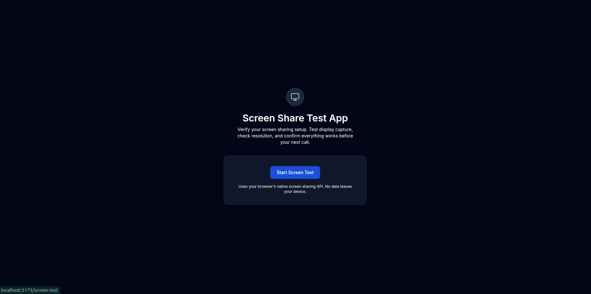
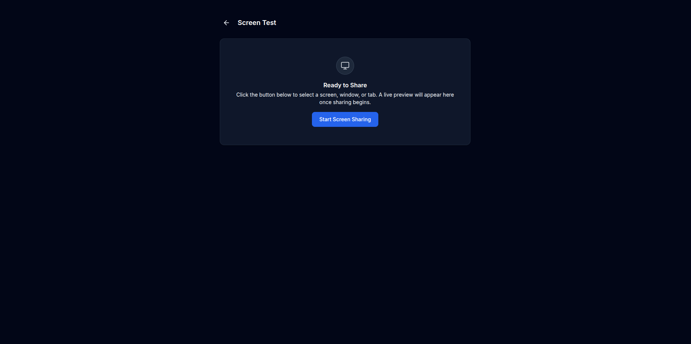
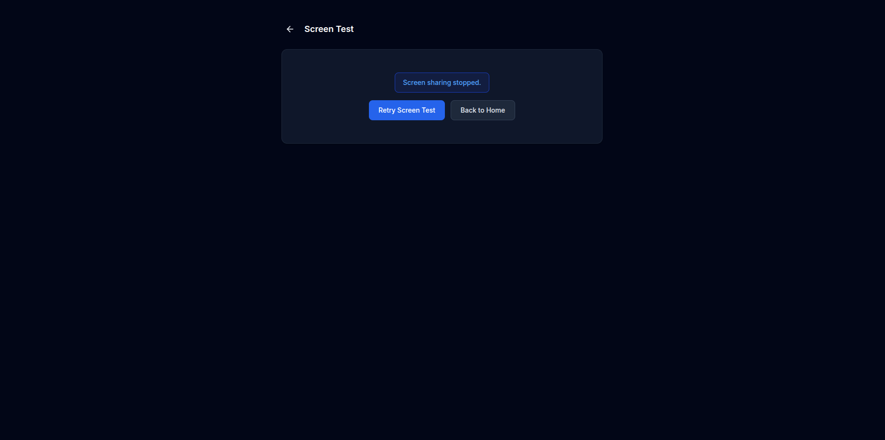

# Screen Share Test App

A lightweight, production-ready React application for testing browser screen sharing capabilities using the native `navigator.mediaDevices.getDisplayMedia` API. No external screen-sharing libraries, no backend — everything runs locally in your browser.

---

## Screenshots

### Home Page (`/`)



### Screen Test — Ready to Share (`/screen-test`)



### Screen Sharing Active — Live Preview


### Screen Sharing Stopped — Retry Flow



---

## Features

- **Native browser screen sharing** — uses `getDisplayMedia` directly
- **Live video preview** with real-time resolution and display surface info
- **Defensive error handling** — distinguishes user cancellation from permission denial and system errors
- **Automatic cleanup** — tracks are stopped and memory is freed on unmount or navigation
- **Fully accessible** — semantic HTML, ARIA labels, keyboard navigable
- **Mobile-safe responsive layout** — works on any screen size

---

## Project Structure

```
src/
├── components/
│   ├── Button.jsx          # Reusable button with primary/secondary variants
│   ├── Card.jsx            # Glass-morphism card wrapper
│   ├── Layout.jsx          # Shared layout with Outlet for child routes
│   ├── Loader.jsx          # Tailwind-only animated spinner
│   └── StatusMessage.jsx   # Color-coded alert messages
├── hooks/
│   └── useScreenShare.js   # Core hook managing the entire media lifecycle
├── pages/
│   ├── Home.jsx            # Landing page with feature detection
│   └── ScreenTest.jsx      # Screen sharing test interface
├── App.jsx                 # Route definitions with lazy loading
├── main.jsx                # App entry point with BrowserRouter
└── index.css               # Tailwind v4 config + design tokens
```

---

## Screen-Sharing Flow

```
┌─────────────────────────────┐
│         Home (/)            │
│  Feature detection check    │
│  "Start Screen Test" link   │
└──────────┬──────────────────┘
           │ navigate
           ▼
┌─────────────────────────────┐
│    ScreenTest (/screen-test)│
│                             │
│  [idle] → Click "Start"     │
│     │                       │
│     ▼                       │
│  [requesting-permission]    │
│     │                       │
│     ├── Granted ────────────│──→ Live video preview
│     │                       │    (resolution + type shown)
│     ├── Cancelled ──────────│──→ "You cancelled" message
│     │                       │
│     ├── Denied ─────────────│──→ "Permission denied" message
│     │                       │
│     └── Error ──────────────│──→ Error message
│                             │
│  [stream-ended]             │
│     Browser or user stopped │
│     → "Retry" / "Back"     │
└─────────────────────────────┘
```

1. **Feature detection** — On the Home page, the app checks `navigator.mediaDevices.getDisplayMedia` before allowing navigation. If unsupported, a browser-unsupported error is shown.

2. **Permission request** — Clicking "Start Screen Sharing" calls `getDisplayMedia({ video: { frameRate: { ideal: 30 } }, audio: false })`. The UI shows a loading spinner and disables the button while the browser's screen picker dialog is open.

3. **Live preview** — On permission grant, the stream is attached to a `<video>` element. Metadata (display surface type + resolution) is extracted via `track.getSettings()`.

4. **Stream lifecycle** — The app listens for `track.onended` to detect when the user stops sharing via the browser's native UI. All tracks are released and the video element is cleared immediately.

5. **Retry flow** — After stopping, the user can retry (starts a fresh `getDisplayMedia` request, no stream reuse) or navigate back home. Old streams are fully released before any new request.

6. **Cleanup on unmount** — The `useEffect` cleanup in `ScreenTest.jsx` calls `cleanupScreenSharing()`, which stops all tracks, clears the video element, and resets state.

---

## Setup & Running

### Prerequisites

- **Node.js** 18+ and **npm** 9+
- A modern browser with screen sharing support (see below)

### Installation

```bash
# Clone and navigate to the project
cd screen

# Install dependencies
npm install

# Start the development server
npm run dev
```

The app will start on `http://localhost:5173` (default Vite port).

### Production Build

```bash
npm run build
npm run preview
```

---

## Browser Support

| Browser         | Screen Sharing | Notes                                    |
| --------------- | -------------- | ---------------------------------------- |
| Chrome 72+      | Full           | Best support, all display surfaces       |
| Edge 79+        | Full           | Chromium-based, same as Chrome           |
| Firefox 66+     | Full           | Supports `displaySurface` metadata       |
| Safari 13+      | Partial        | May require user gesture, limited metadata |
| Mobile browsers | None           | `getDisplayMedia` not supported on mobile |

---

## Known Limitations

- **HTTPS required** — `getDisplayMedia` only works on secure origins (`https://` or `localhost`)
- **No mobile support** — screen capture APIs are not available on mobile browsers
- **No audio capture** — audio is explicitly disabled (`audio: false`) to keep the test focused on video
- **Single stream** — only one screen share session at a time
- **Browser-specific dialogs** — the screen picker UI varies across browsers and cannot be customized

---

## Browser Quirks

- **Chrome/Edge** — The `NotAllowedError` thrown when the user cancels the screen picker includes "Permission denied" in its message, making it indistinguishable from an actual permission denial at the OS level without checking the message string. The app uses heuristic message-matching (`cancel`, `abort`, `Permission denied`) to differentiate these cases.
- **Firefox** — Reports `displaySurface` metadata correctly for tabs, windows, and monitors. However, the screen picker dialog appearance and behavior differs significantly from Chromium browsers.
- **Safari** — May not populate `displaySurface` in `track.getSettings()`, returning `undefined`. The app falls back to showing "Unknown Source" in this case. Safari also requires a user gesture (click) to trigger `getDisplayMedia`.
- **All browsers** — The `track.onended` event fires when the user clicks "Stop sharing" in the browser's native sharing indicator, but the timing can vary slightly. The app immediately clears state on this event to avoid stale UI.

---

## Tech Stack

| Technology       | Version | Purpose                       |
| ---------------- | ------- | ----------------------------- |
| React            | 19.x    | UI framework                  |
| Vite             | 7.x     | Build tool & dev server       |
| Tailwind CSS     | 4.x     | Utility-first CSS framework   |
| React Router DOM | 7.x     | Client-side routing           |

---

## License

MIT
